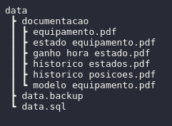

# aiko - Entrega Teste Estágio Backend V2 

A documentação se encontra na pasta: 

Ou pode ser acessada nos links:

* [Equipamento](https://documenter.getpostman.com/view/13406313/Uyxhn6vT)
* [Estado equipamento](https://documenter.getpostman.com/view/13406313/Uyxhn6zj)
* [Ganho por hora em cada estado](https://documenter.getpostman.com/view/13406313/Uyxhn6zk)
* [Historico estados](https://documenter.getpostman.com/view/13406313/Uyxhn6zm)
* [Historico posições](https://documenter.getpostman.com/view/13406313/Uyxhn6zn)
* [Modelo equipamento](https://documenter.getpostman.com/view/13406313/Uyxhn6zo)

#### Ferramentas

- Maven - Para gerenciar as dependências e automatizar builds.
- Spark Framework *[dependência]* - Micro framework para criar pequenas APIs REST. 
- org.postgresql *[dependência]* - Para trabalhar com PostgreSQL (JDBC Driver).
- org.json *[dependência]* - Para gerar objetos JSON.
- phpPgAdmin - Para visualizar o BD.
